# Git入門

Published by Seiichi Yonekura

---

## Gitとは

- バージョン管理システム(VCS)
  - 他のVSC
    - Subversion
    - Mercurial
    - Visual SourceSafe
- VSCの中での[Gitのシェアは約90%](https://insights.stackoverflow.com/survey/2018#work-_-version-control)
- 最近では転職の際にGitHubのアカウントを求められることも

## Gitを利用するメリット

- ファイル名で分けなくて良くなる
  - source_code.txt
  - source_code_20220401.txt
  - source_code_v2.txt
  
- コメントアウトを減らせる
  - GitHub上に履歴が残っているので、削除してしまっても履歴を辿れる
  - ソースコードとして意味のある行のみを残せる

## Gitの苦手なところ

- バイナリファイルの管理
  - エクセルファイルなどのバイナリファイルもファイルに変更があったかは検知できるが、どこが変わったかまではわからない

## Gitの概要図と用語

### ブランチ

