# GitHubを利用したワークフロー

## GitHubの運用法

### GitHub flow


ブランチの命名

- main
    - リリース用のブランチ
- feature/XXX
    - 機能開発用のブランチ。mainブランチから派生させる。
- hotfix/XXX
    - mainで見つかったバグを修正するブランチ。mainから派生させる。

## 機能開発



### 1. ブランチをつくる

```bash
> git branch <ブランチ名>
```

### 2. リモートに公開

```
> git push origin/<ブランチ名>
```

### 4. 編集したソースコードをステージング

```bash
#  特定のファイルをステージング
> git add <filename>
# 変更があったすべてのファイルをステージング
> git add .
```

### 5. 変更をコミット
```bash
> git commit -m "<どのような変更を加えたかコメント>"
```

### 6. コミットをリモートリポジトリに公開

```bash
> git push origin/<ブランチ名>
```

### 7. プルリクエストを作成